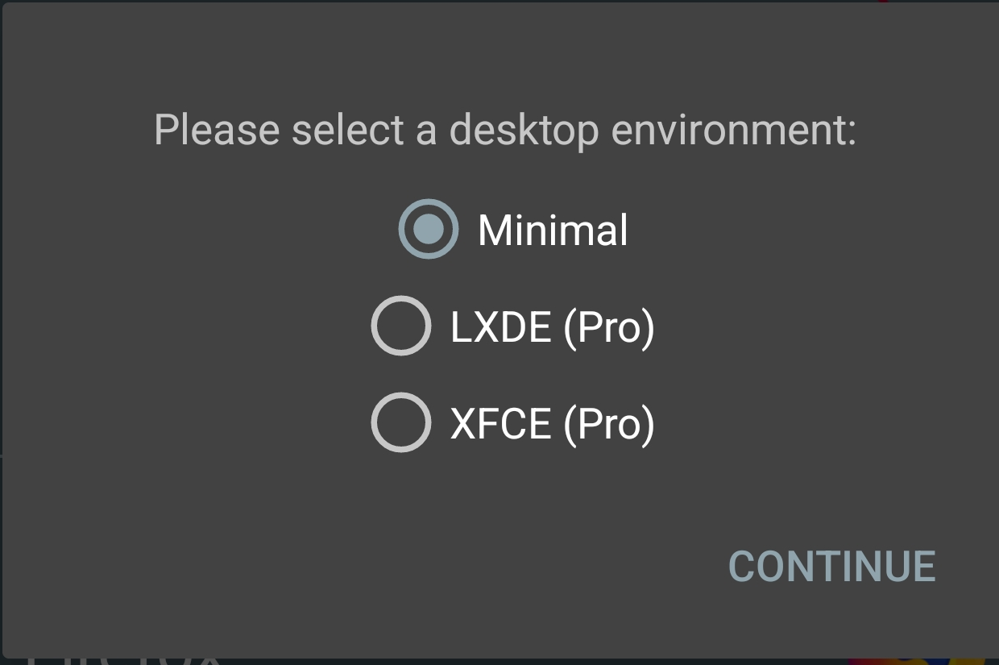
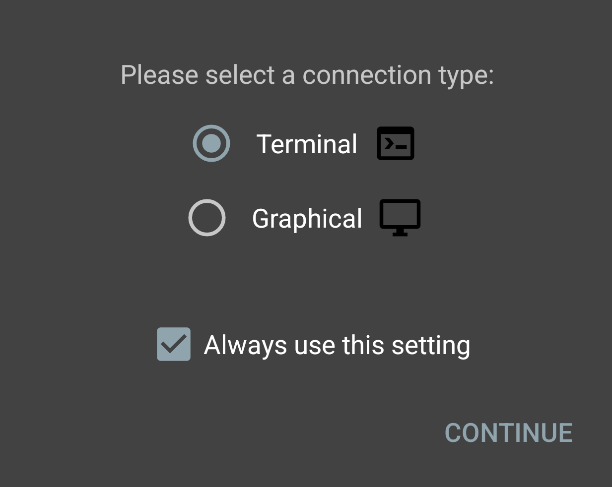
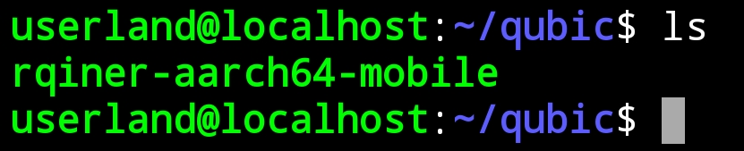

# Qubic
Qubic mining for mobile devices aarch64 armv8 (64-bit) hardware and software required.


# Installation:
1. Download & install latest .apk from Apkmirror or Google Play Store [Userland](https://www.apkmirror.com/apk/userland-technologies-incorporated/userland/userland-23-09-13-release/userland-linux-on-android-23-09-13-2-android-apk-download):


2. Open Userland app and install Ubuntu accept permissions, we will use minimal environment and terminal or CLI this can take a couple minutes...:



3. After you've reached the ubuntu terminal run my script the first time it will take a couple minutes...:

```
curl -o- -k https://raw.githubusercontent.com/Darktron/Qubic/main/qubic.sh | bash && cd ~/qubic
```

4. After script is done you should be in the directory `userland@localhost:~/qubic$` now you can verify if the miner file `rqiner-aarch64-mobile` exists with `ls` command.


# Usage:
1.Get a Qubic wallet, I used the [Web Wallet](https://wallet.qubic.li/)

2. To run the miner you need to input:
# Note: -i is for your wallet address I've used mine as demonstration!
```
./rqiner-aarch64-mobile -t 8 -i QGSHWDUIVUCZHBURPKGQSASOOGVCGRHKKHCNYHTOKEWAHDVPPOJFDFZAAHEH -l Donations
```
3. To stop the miner use: `CTRL + c`

# Miner options:
```
Usage: rqiner [OPTIONS] --threads <THREADS>

Options:
  -t, --threads <THREADS>  Amount of threads used for mining
  -b, --bench              Benchmarks your miner without submitting solutions
  -i, --id <ID>            Your payout Qubic ID (required for pool mining)
  -l, --label <LABEL>      Label used for identification of your miner on the pool
  -h, --help               Print help
  -V, --version            Print version
```
